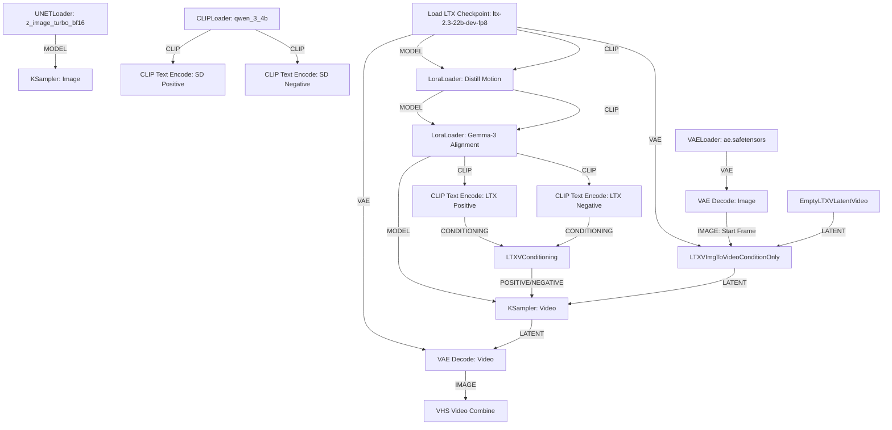

# Dual-Stage Local AI Cartoon Video Animator (Z-Image-Turbo + Distilled LTX-2.3) - Implementation Plan

We will update `workflow.json` on the root of your project directory (`c:\Users\gagan\stash\workflow`) to match your exact local LTX-2.3 model files and fix the case-sensitive `UNETLoader` definition.

---

## 1. Loader Upgrades (LTX-2.3 + LoRAs)

Because LTX-2.3-dev is an FP8 base model, it requires loading the base checkpoint and passing it through the motion distillation LoRA and the Gemma-3 text encoder LoRA.

### Node Updates
1. **UNETLoader (Node 1)**: Corrected case to `UNETLoader` to resolve the ComfyUI missing node error.
2. **CheckpointLoaderSimple (Node 10)**: Loads `ltx-2.3-22b-dev-fp8.safetensors`.
3. **LoraLoader 1 (Node 24)**: Loads `ltx_2.3_22b_distilled_1.1_lora_dynamic_fro09_avg_rank_111_bf16.safetensors`.
4. **LoraLoader 2 (Node 25)**: Loads `gemma-3-12b-it-abliterated_lora_rank64_bf16.safetensors`.
5. **LTXVImgToVideoConditionOnly (Node 15)**: Stays the same (part of `ComfyUI-LTXVideo` custom node pack).

---

## 2. Verification Plan

### Manual Verification
1. Re-generate `workflow.json` with the updated node classes and LoRA chains.
2. Verify syntax.
3. Import into ComfyUI.
4. Open ComfyUI Manager and install `ComfyUI-LTXVideo` to resolve the `LTXVImgToVideoConditionOnly` node pack.
